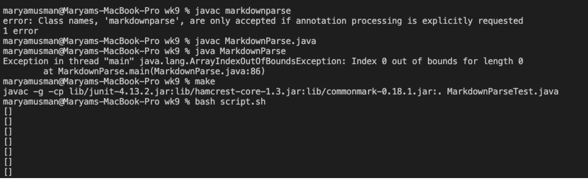
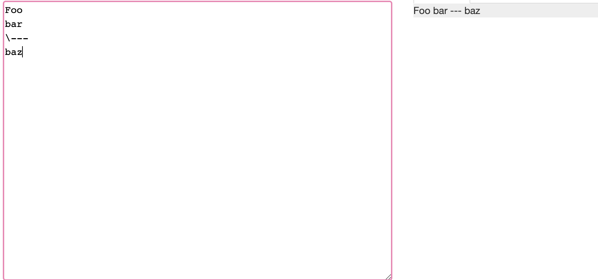
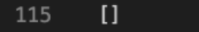
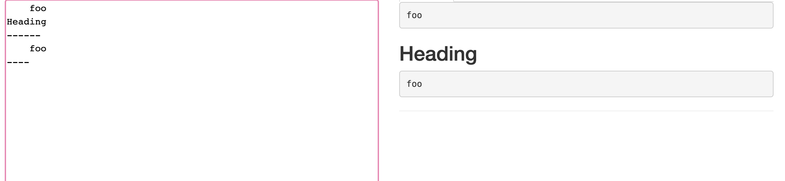
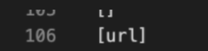
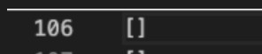
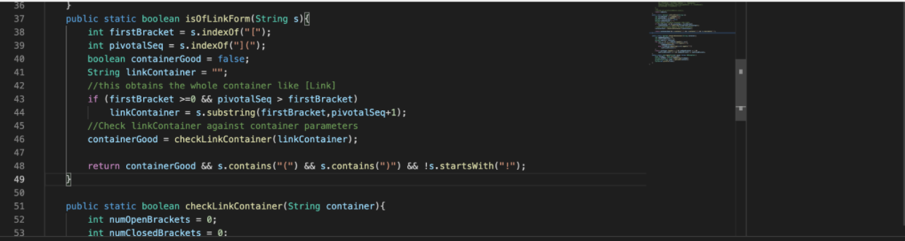
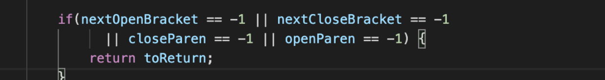

# Lab Report 5
### How you found the tests with different results (Did you use diff on the results of running a bash for loop? Did you search through manually? Did you use some other programmatic idea?)

I used bash script.sh to copy the output onto a txt then I used diff to see the differences. I noticed a difference between my file and Joes on test file 106 and 115. 

### Describe which implementation is correct, or if you think neither is correct, by showing both actual outputs and indicating what the expected output is.

### test 106.md
this is the expected output. 

THe output of Joes and mine are different. 
Joes output: 

My output: 

For test 115 my implementation is correct and joes is incorrect. This is because it outputs [baz] whereas in the code there is no valid outputted link it should output [] instead. Mine outputs [] which is what was intended. 
 
### test 115.md

this is the expected output:

His results for 115: 

Our results: 

For test 115.md
Mine is correct and joes is incorrect this is becz theree is no valid link and joes outputs [url]. the output should be []. 
#### Describes bug in code for one of the incorrect implementation and shows the code that should be fixed.

i think the bug here is in joes . It seems like joes takes everything between the parenthesis as a link when thats not how is should output. I think also the use of the open parenthesis within the [ ] may be a cause for error. this is for test 115.md
### For the implementation that’s not correct (or choose one if both are incorrect), describe the _bug (the problem in the code). You don’t have to provide a fix, but you should be specific about what is wrong with the program, and show the code that should be fixed.

for test 106.md
I think the error is here. This is because of the open and close bracket errors which may have caused the links to show up. It may have malfunctioned in deciding on whether it should be in link form which caused for example test 106 to show a link when there was no link in the test file.  

